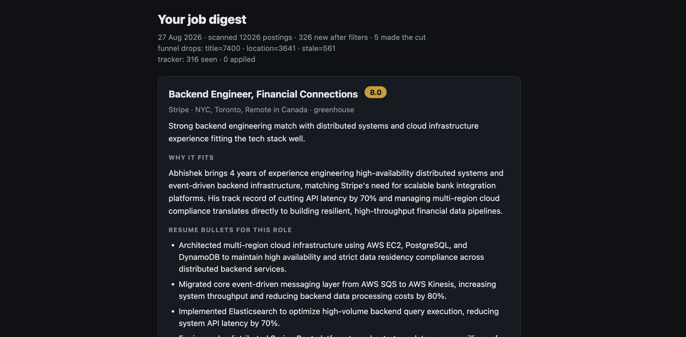
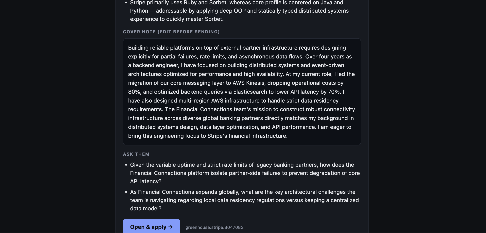

# jobhunt

Personal job-search agent. Every weekday morning it:

1. Pulls open roles from public ATS boards (Greenhouse, Lever, Ashby)
2. Drops ~99% with free regex / location / freshness filters
3. Scores what’s left against your resume (LLM)
4. Drafts an application kit for the best few
5. Emails you a short digest

**It never applies for you.** You read the digest, edit the cover note, and submit yourself.

```
~3000 postings  →  ~20 candidates  →  ~5 in your inbox
     fetch           prefilter              LLM screen + draft
                   (no LLM cost)
```

### Digest preview

A scored match with tailored resume bullets:



Drafted cover note, questions to ask, and an apply link — you still submit yourself:



New to Python? Use **[SETUP.md](SETUP.md)** (step-by-step). This README is the short path.

---

## Quick demo (no API keys)

```bash
git clone git@github.com:abhisheknetradyne/jobhunt.git
cd jobhunt
python3 -m venv .venv && source .venv/bin/activate   # Windows: .venv\Scripts\activate
pip install -r requirements.txt

python -m jobhunt run --mock --scorer keyword
open out/digest.html   # or just open the file in a browser
```

`--mock` uses bundled fixtures through the **real** parsers. `--scorer keyword` is a dumb offline stub — fine for plumbing, not for real applications.

---

## Real setup

### 1. Companies

There is **no single public API that lists every company’s jobs**. LinkedIn,
Naukri, Indeed and Google Jobs are not used (no unauthenticated API; scraping
violates their ToS). Instead we poll each company’s documented ATS board.

Edit [`companies.yaml`](companies.yaml). Slug = last path segment of the careers board:

| Board URL | `ats` | `slug` |
|---|---|---|
| `boards.greenhouse.io/stripe` | `greenhouse` | `stripe` |
| `jobs.lever.co/meesho` | `lever` | `meesho` |
| `jobs.ashbyhq.com/openai` | `ashby` | `openai` |

The shipped list is ~70 verified boards (Greenhouse, Lever, Ashby), including
India-hiring companies (Postman, PhonePe, Groww, Thoughtworks, Meesho, CRED)
plus infra, product, and AI labs. Stripe is one Greenhouse board among many —
Databricks, Cloudflare, GitLab, MongoDB, Datadog, etc. are polled the same way.

Dead slugs print an HTTP status and return nothing — they don’t crash the run.
Location and exclude-title filters still drop most postings before any LLM call.

### 2. Filters (`config.yaml`)

Runs **before** any LLM call. This is what keeps cost tiny.

```yaml
filters:
  include_titles: []          # empty = accept any title
  exclude_titles: ['\b(staff|principal|manager)\b', '\b(frontend|mobile|qa)\b', ...]
  locations: [bangalore, bengaluru, india]
  allow_remote: true
  max_age_days: 1           # default: last 1 day only

score_threshold: 7.0
max_per_digest: 5
```

Title filtering is **exclude-only**: roles are not required to match a narrow
include list, so broader software-engineer titles can reach the LLM. Excludes
still drop staff/principal/manager, frontend/mobile, QA, sales, etc.

- Default freshness is **1 day**. Set `max_age_days: null` to disable, or
  override for one run: `python -m jobhunt run --max-age-days 14`

### 3. Secrets (`.env`)

```bash
cp .env.example .env
```

| Variable | Purpose |
|---|---|
| `LLM_PROVIDER` | e.g. `gemini` |
| `GEMINI_API_KEY` | from [Google AI Studio](https://aistudio.google.com/apikey) (or Anthropic / Groq keys) |
| `SMTP_USER` | your Gmail address |
| `SMTP_PASS` | Gmail [App Password](https://myaccount.google.com/apppasswords) (16 chars) — **not** your login password |
| `MAIL_TO` | digest recipient |

### 4. Profile from your resume

```bash
python -m jobhunt profile --resume resume.pdf
```

Writes gitignored `profile.json`. Skim it and fix anything the model got wrong.

### 5. Run

```bash
python -m jobhunt run                         # write out/digest.html
python -m jobhunt run --send                  # also email MAIL_TO
python -m jobhunt run --send --max-age-days 14
python -m jobhunt run --limit 10              # cost guard while tuning
python -m jobhunt recent                      # newest tracked roles
python -m jobhunt applied "<job_id>"          # mark applied (id is in the digest)
python -m jobhunt stats
```

`--send` also emails **empty-day diagnostics** (title / location / stale / already-seen counts) when nothing makes the cut.

Delivery is **email only**.

---

## Daily schedule (GitHub Actions)

[`.github/workflows/daily.yml`](.github/workflows/daily.yml) runs at **06:00 IST** on weekdays.

`seen.json` (dedupe + tracker) is **gitignored** and restored in CI via `actions/cache` — never commit it.

Repo **secrets** to set:

| Secret | What |
|---|---|
| `PROFILE_JSON` | full contents of local `profile.json` |
| `GEMINI_API_KEY` | (or `ANTHROPIC_API_KEY` / `GROQ_API_KEY`) |
| `SMTP_USER` / `SMTP_PASS` | Gmail + App Password |
| `MAIL_TO` | inbox for digests |

Optional **variables**: `LLM_PROVIDER`, `SCREEN_MODEL`, `DRAFT_MODEL`, …

Smoke-test: Actions → *daily job digest* → *Run workflow* with `dry_run` checked.

---

## LLM providers

| Provider | `LLM_PROVIDER` | Key | PDF resumes |
|---|---|---|---|
| Google Gemini | `gemini` | `GEMINI_API_KEY` | yes |
| Anthropic | `anthropic` | `ANTHROPIC_API_KEY` | yes |
| Groq | `groq` | `GROQ_API_KEY` | no |
| OpenAI-compatible | `openai-compatible` | + `LLM_BASE_URL` | no |
| Ollama | `ollama` | none | no |

Screen cheap, draft strong — override per stage with `SCREEN_PROVIDER` / `DRAFT_PROVIDER` and matching `*_MODEL` vars.

---

## Project layout

```
jobhunt/
  fetch.py       Job model + ATS parsers + fetch_all
  prefilter.py   title / location / freshness (no LLM)
  providers.py   swappable LLM backends
  llm.py         screen / draft / profile / keyword stub
  digest.py      HTML email (inline CSS for Gmail)
  mailer.py      SMTP
  store.py       seen.json + tracker CSV
  mock.py        offline fixtures
  cli.py         profile / run / recent / applied / stats
config.yaml      filters & thresholds
companies.yaml   boards to poll
.github/workflows/daily.yml
tests/           offline suite (no network, no keys)
```

---

## Tests

```bash
python -m pytest tests -q
```

---

## Cost

Tight filters + a cheap screen model (Gemini free tier / Groq / Haiku) keep this in the low single-digit rupees per day — often free. Use `--limit` while tuning so a bad regex can’t burn tokens.

---

## License / privacy

Personal tool. Keep `.env`, `profile.json`, `resume.*`, and `seen.json` out of git (already gitignored). Rotate any keys you ever paste into chat.
